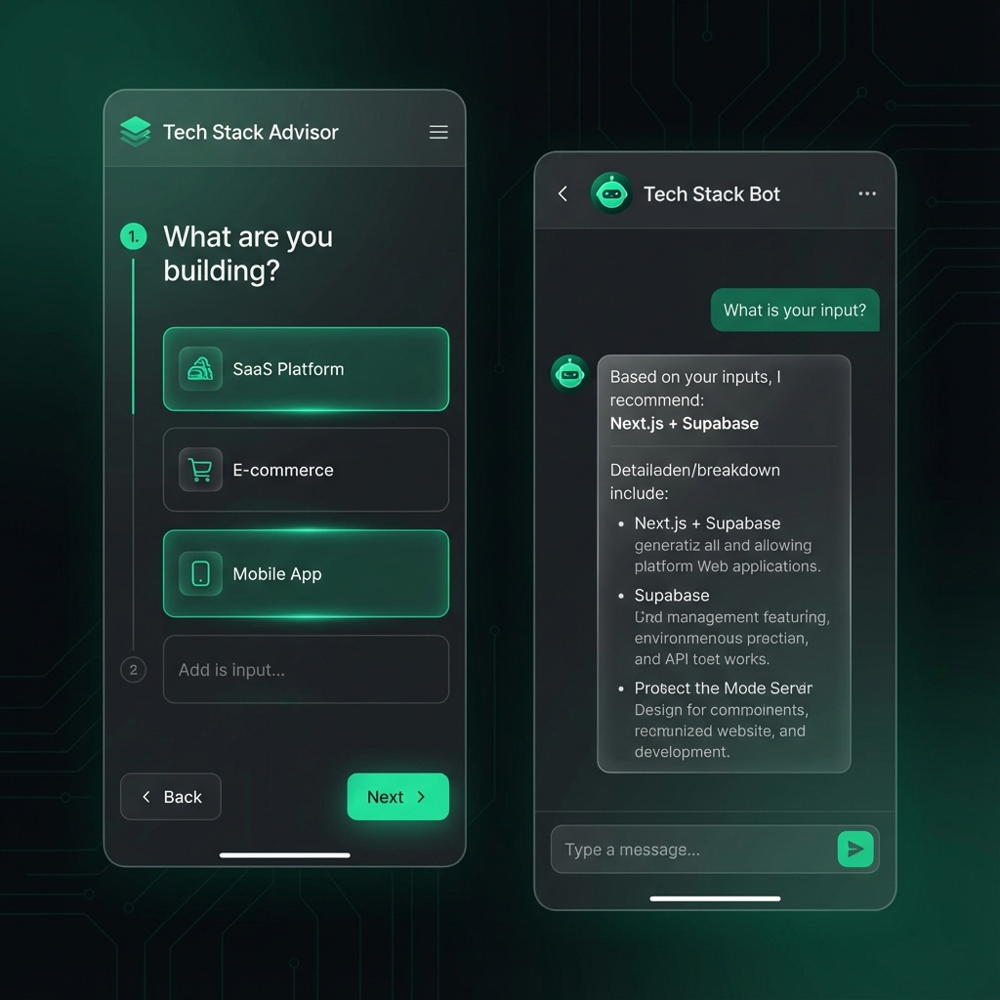

# 🧠 Tech Stack Advisor

> Get personalized technology stack recommendations for your next project — powered by AI or a smart scoring engine.

[](https://kartikeykumar.com/tools/tech-stack-advisor/)
[](https://react.dev)
[](https://typescriptlang.org)
[](https://vitejs.dev)




## ✨ Features

### 🎯 Quick Mode (Static)
- **5-Question Wizard**: Guided flow to understand your requirements
- **Smart Scoring Engine**: Weighted algorithm that scores technologies
- **4-Category Recommendations**: Frontend, Backend, Database, Hosting
- **Pros/Cons Display**: Trade-offs for each recommendation

### 🤖 AI Chat Mode
- **Conversational Interface**: Chat naturally about your project
- **Multi-Provider Support**: OpenAI (GPT-4o) and Google Gemini
- **Dynamic Model Selection**: Choose from available AI models
- **Contextual Suggestions**: AI-generated quick-reply buttons
- **Markdown Rendering**: Formatted responses with lists and emphasis
- **Secure**: API keys stored locally, never sent to our servers

## 🚀 Quick Start

### Prerequisites
- Node.js 18+
- npm or yarn

### Installation

```bash
# Clone the repository
git clone https://github.com/kartikeykumar09/tech-stack-advisor.git
cd tech-stack-advisor

# Install dependencies
npm install

# Start development server
npm run dev
```

Open [http://localhost:5174](http://localhost:5174) in your browser.

### Build for Production

```bash
npm run build
```

Output will be in the `dist/` folder.

## 🛠️ Tech Stack

| Component | Technology |
|-----------|------------|
| Framework | React 18 + TypeScript |
| Build Tool | Vite 5 |
| Styling | Vanilla CSS (Emerald accent) |
| Icons | Lucide React |
| AI APIs | OpenAI, Google Gemini |

## 📁 Project Structure

```
src/
├── App.tsx              # Main component with dual modes
├── index.css            # Complete styling
├── main.tsx             # Entry point
├── data/
│   ├── questions.ts     # Wizard question definitions
│   └── technologies.ts  # Tech data + scoring engine
└── services/
    └── ai.ts            # AI API integrations
```

## 🔧 Configuration

### For Standalone Deployment

Update `vite.config.ts` base path:

```typescript
export default defineConfig({
  base: '/', // Change from '/tools/tech-stack-advisor/'
  plugins: [react()],
})
```

### AI API Keys

API keys are managed in the browser:
- Click the ⚙️ settings icon in the chat input
- Select your provider (Gemini recommended)
- Paste your API key
- Keys are stored in `localStorage` and sent directly to the provider

Get API keys:
- **Gemini**: [Google AI Studio](https://aistudio.google.com/app/apikey)
- **OpenAI**: [OpenAI Platform](https://platform.openai.com/api-keys)

## 🤝 Contributing

Contributions are welcome! Here's how you can help:

### Adding New Technologies

Edit `src/data/technologies.ts`:

```typescript
{
  id: 'your-tech',
  name: 'Your Technology',
  category: 'frontend', // frontend | backend | database | hosting
  description: 'Brief description',
  pros: ['Pro 1', 'Pro 2'],
  cons: ['Con 1'],
  scores: {
    projectType: { webapp: 10, api: 5, mobile: 3 },
    scale: { mvp: 8, small: 9, medium: 7, large: 5 },
    experience: { beginner: 6, intermediate: 9, advanced: 10 },
    priority: { speed: 8, performance: 7, cost: 9, scalability: 6 },
    features: { seo: 5, realtime: 8, ai: 7 }
  }
}
```

### Improving AI Prompts

Edit `src/services/ai.ts` to improve the system prompt for better recommendations.

### Development Workflow

1. Fork the repository
2. Create a feature branch: `git checkout -b feature/your-feature`
3. Make your changes
4. Run `npm run build` to verify
5. Commit: `git commit -m "Add your feature"`
6. Push: `git push origin feature/your-feature`
7. Open a Pull Request

## 📄 License

MIT License - feel free to use this in your own projects!

## 🙏 Acknowledgments

- Built by [Kartikey Kumar](https://kartikeykumar.com)
- Part of the [Free Developer Tools](https://kartikeykumar.com/tools) suite

---

**[🔗 Live Demo](https://kartikeykumar.com/tools/tech-stack-advisor/)** | **[🐛 Report Bug](https://github.com/kartikeykumar09/tech-stack-advisor/issues)** | **[💡 Request Feature](https://github.com/kartikeykumar09/tech-stack-advisor/issues)**
